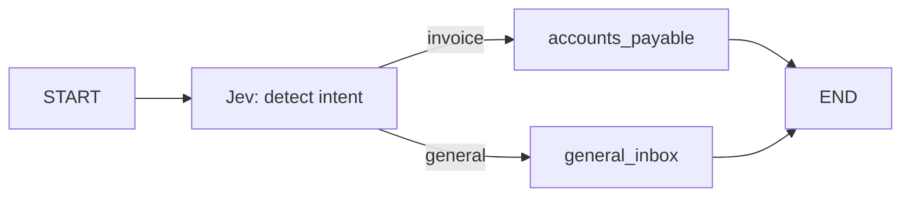

# Jev email intent workflow

A small async LangGraph workflow that sends a mocked email to TypeSafe's Jev model,
receives a typed `Choice` (`invoice` or `general`), and routes to a demo handler.
The handlers only set a destination in graph state; they do not send email or make payments.



## Run

Requires Python 3.10+ and uv:

```bash
uv sync
# Create .env using .env.example as a guide; keep an existing .env.
# Set TYPESAFE_API_KEY to your TypeSafe key.
uv run python main.py
# Or run just one email:
uv run python main.py --email-id email-09
```

The input emails are mocked; classification makes real TypeSafe API calls (one per
email). The default model is `jev-1.12`; override it with `TYPESAFE_DEFAULT_MODEL`
if needed for your account. Output includes intent, confidence, both label
probabilities, destination, model, and comparison against the expected label.
API failures stop execution rather than assigning a fabricated intent.

`data/mock_emails.json` contains 10 labeled examples: five invoice requests and five
general emails, including two general emails that mention invoices. `invoice` covers
invoice delivery, copies, corrections, disputes, and payment follow-ups. `general`
is the catch-all for other primary intents. Expected labels are used only for
evaluation and never sent to Jev. These examples are a smoke check, not an accuracy benchmark.

The graph is in `src/typesafe_ai_langgraph/typesafe_ai_langgraph_workflow.py`.
To use another email, call `await build_workflow(client).ainvoke({"email": email})`
with an email containing `id`, `sender`, `subject`, and `body`, while the async
client is open. Confidence is exposed for inspection; this demo always routes to
one of the two handlers.

## Tests

```bash
uv run python -m unittest discover -s tests -v
```

Tests mock the SDK response and run the actual graph without credentials or network.
They verify routing and input isolation, not Jev's semantic accuracy.

References: [TypeSafe Python API](https://docs.typesafe.ai/sdk/python/api),
[Choice](https://docs.typesafe.ai/primitives/choice), and
[LangGraph Graph API](https://docs.langchain.com/oss/python/langgraph/graph-api).
